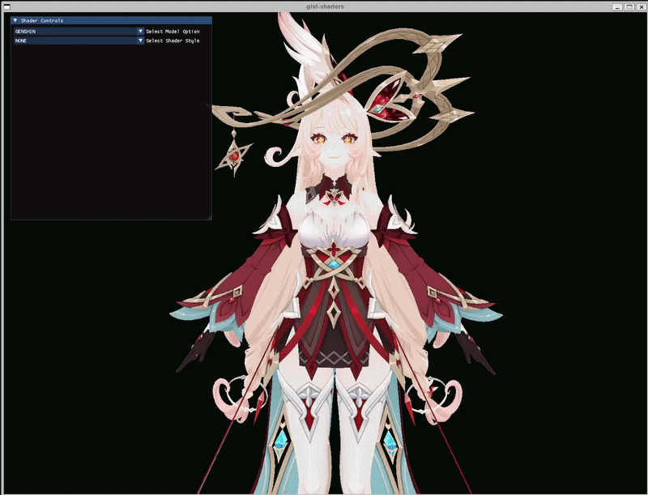
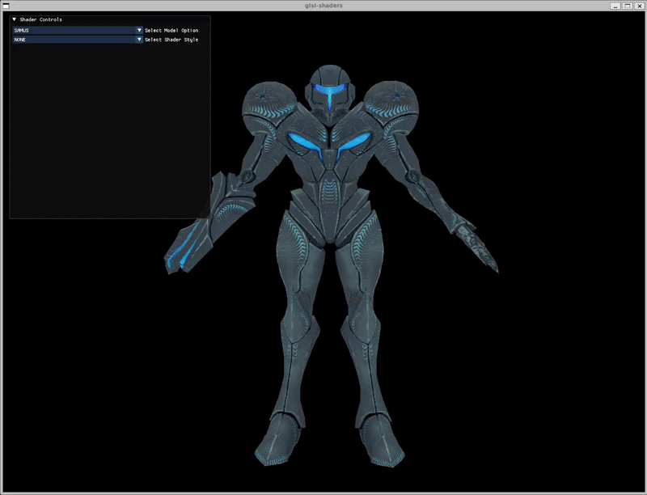
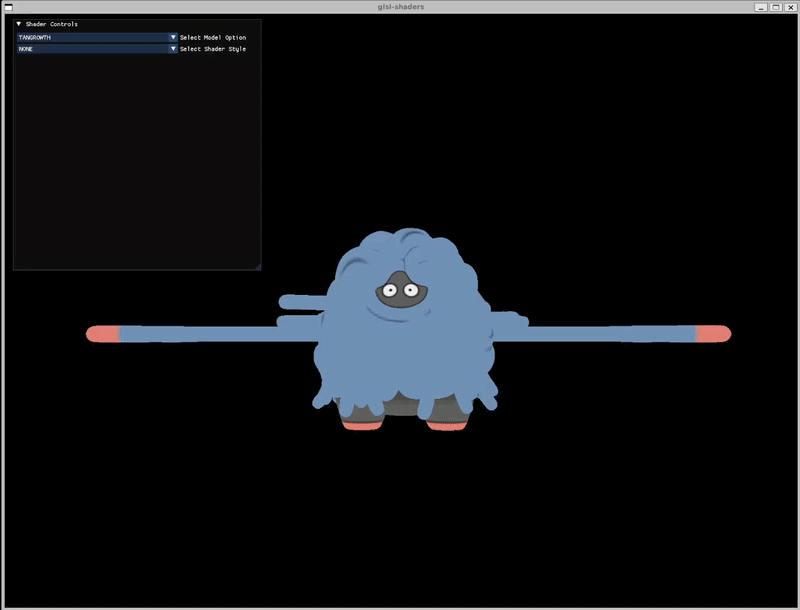

# OpenGL Shader Showcase

A growing collection of stylized GLSL shaders built on a **deferred rendering** pipeline. Instead of lighting the model as it is drawn, the scene is rendered in stages and passed from one off-screen framebuffer to the next.

1. **Geometry pass.** The model is drawn once into a G-buffer (a set of textures) that stores the world position, the surface normal read from a normal map, and the base colour plus specular for every pixel. No lighting happens yet. This stage only captures the geometry. Each style has its own G-buffer holding only the channels it needs.
2. **Lighting and style pass.** A single full-screen quad reads the G-buffer and runs the chosen style shader (anime, manga, or isophotes) to produce the stylized image. The anime pass writes two outputs at once. One holds the shaded colour and the other holds only the bright pixels for bloom.
3. **Bloom.** The bright-pixel texture is blurred back and forth with a ping-pong Gaussian blur to spread the glow.
4. **HDR pass.** The lit image and the blurred bloom are combined and tone mapped down to a displayable range. Reinhard, GT Tonemapping, and ACES processing techniques are supported. 
5. **Passthrough.** A final shader copies the finished texture straight to the screen.

The amount of light on a surface is measured as `dot(normal, lightDirection)`, written below as N·L, where 1 means facing the light and 0 means facing away.

- **Anime.** Instead of a smooth light falloff, the surface is split into two flat tones. Anything above an N·L threshold gets the lit colour and everything else gets a darker shadow colour, which gives the flat cel shaded look. On top of that there is a tinted highlight where the light reflects toward the camera, a saturation slider, a glowing rim light on the sides facing away from the light, and a bloom pass that makes the brightest pixels glow.
- **Manga.** Black and white only. The N·L value is sliced into a few brightness ranges and each range is filled with a different hand drawn pattern. Darker areas stack more layers of diagonal and horizontal hatching lines, mid tones get a dot pattern called screentone, and lit areas stay white. Object outlines are drawn by detecting where the normal or depth suddenly jumps between neighbouring pixels.
- **Isophotes.** Draws contour lines across the surface wherever the lighting hits set brightness levels, like a topographic map but for light. Each line stays the same thickness on screen no matter the distance or angle, by scaling it with the rate the lighting changes across nearby pixels.

## Built with

- **[enginemath](https://github.com/AdrianYip1/enginemath.git)**, my own math library, used for all vector and matrix math
- **[OpenGL](https://www.opengl.org/)** for rendering, with **[GLAD](https://github.com/Dav1dde/glad)** (loader), **[GLFW](https://github.com/glfw/glfw)** (windowing and input), and **[Dear ImGui](https://github.com/ocornut/imgui)** (UI)
- **[Assimp](https://github.com/assimp/assimp)** for model loading
- **[stb_image](https://github.com/nothings/stb)** for texture loading

## Images and Videos

<b>GENSHIN</b>

| GIF |
|:---:|
|  |

| Normal | Anime |
|:---:|:---:|
|  |  |

| Manga | Isophotes |
|:---:|:---:|
|  |  |

<b>SAMUS</b>

| GIF |
|:---:|
|  |

| Normal | Anime |
|:---:|:---:|
|  |  |

| Manga | Isophotes |
|:---:|:---:|
|  |  |

<b>TANGROWTH</b>

| GIF |
|:---:|
|  |

| Normal | Anime |
|:---:|:---:|
|  |  |

| Manga | Isophotes |
|:---:|:---:|
|  |  |

## Credits

- **Alice** (Genshin) model by [animanpower on DeviantArt](https://www.deviantart.com/animanpower/art/Genshin-Impact-Alice-for-XPS-MMD-Blender-1295054457)
- **Samus** and **Tangrowth** models by [shinteo on DeviantArt](https://www.deviantart.com/shinteo/)
