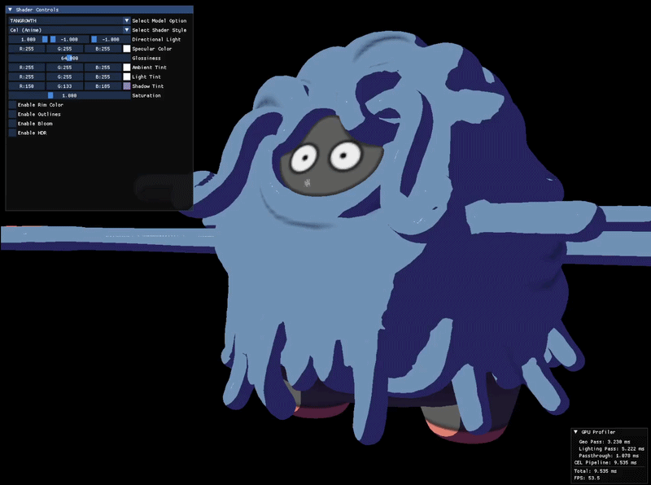
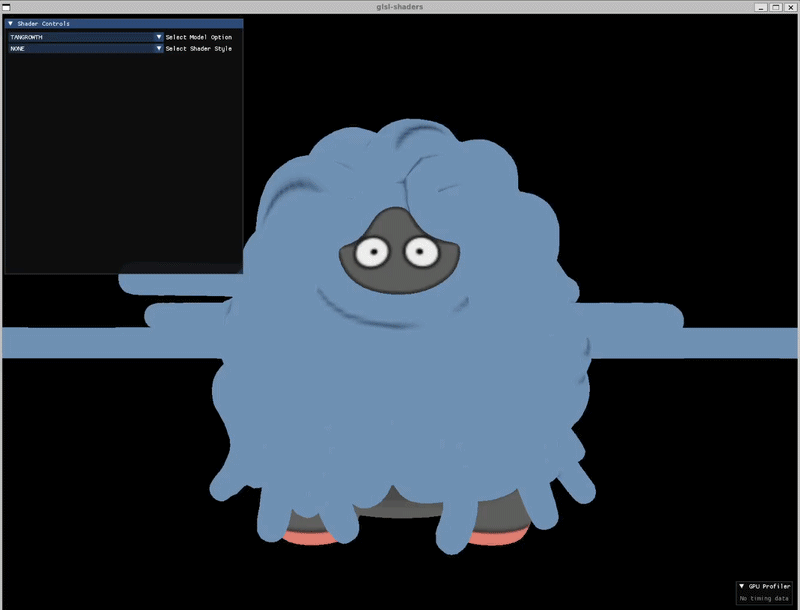
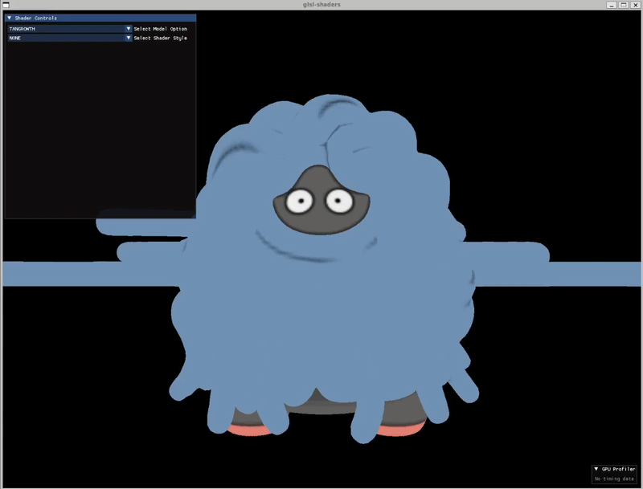
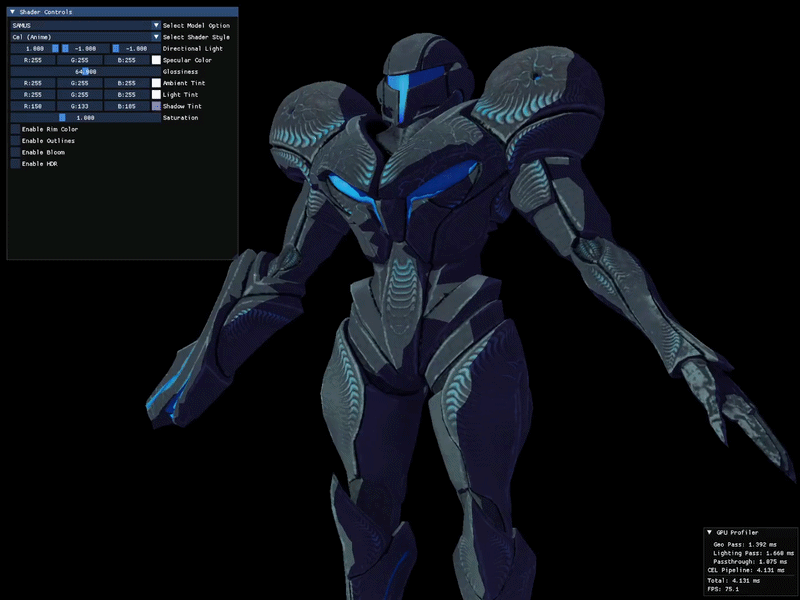
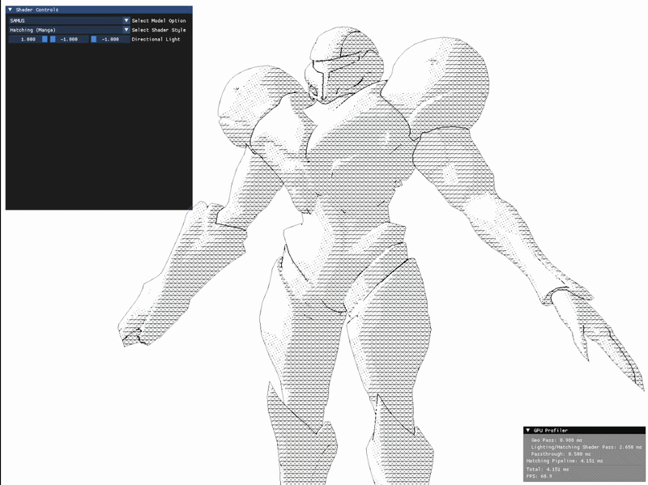
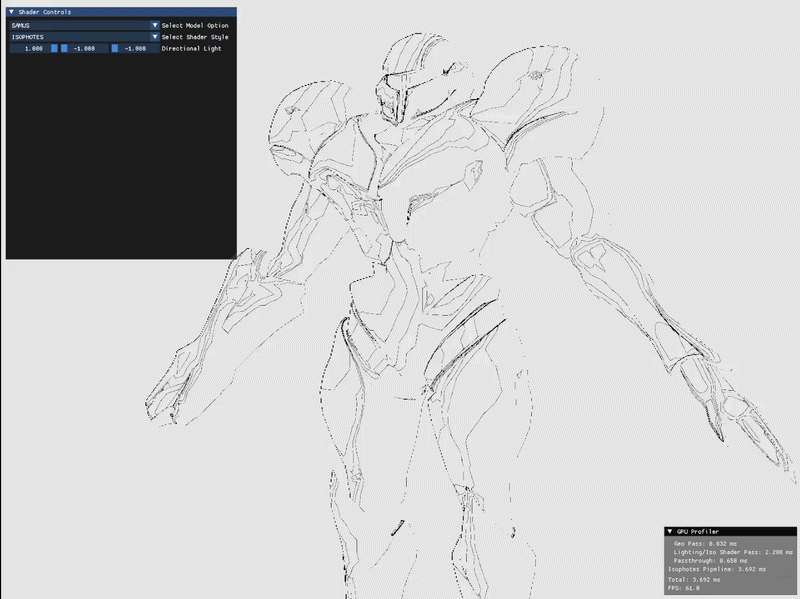
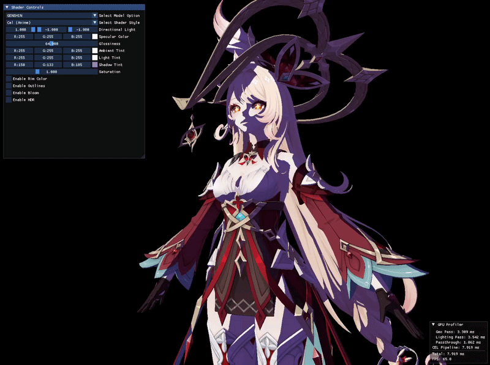
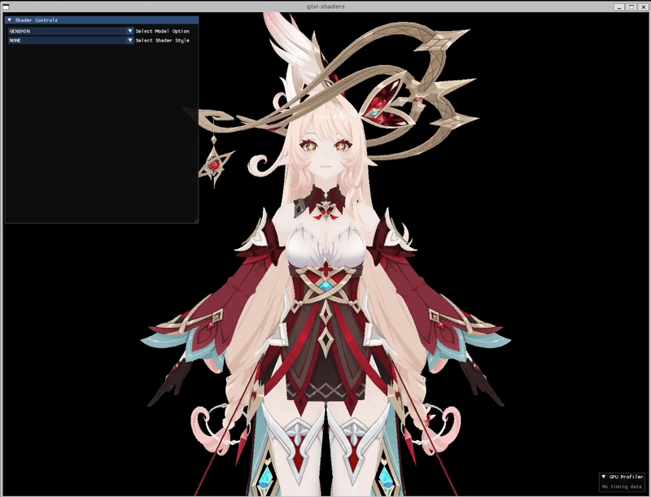
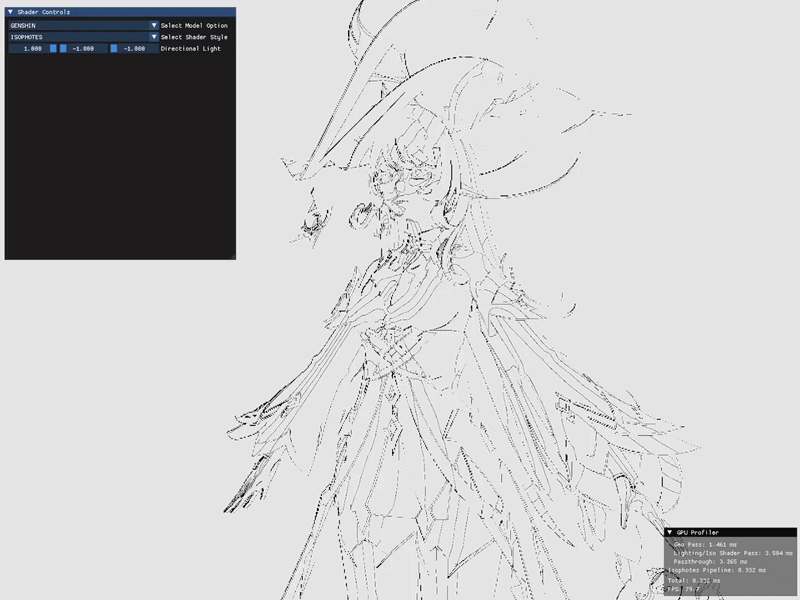

# OpenGL Shader Renderer

<p align="center">
  
  
</p>

A collection of stylized GLSL shaders built on a **deferred rendering** pipeline. The non-photorealistic styles are inspired by anime and manga art (in particular the cel shading of *Guilty Gear Xrd*) but named after the techniques they implement (cel shading, cross-hatching, isophotes). Instead of lighting the model as it is drawn, the scene is rendered in stages and passed from one off-screen framebuffer to the next.

## Additional Images and Video

<p align="center">
  <a href="https://www.youtube.com/watch?v=YQR7FR57fY0">
    
  </a>
</p>

<p align="center"><a href="https://www.youtube.com/watch?v=YQR7FR57fY0">Watch the demo on YouTube</a></p>

<details>
<summary><b>TANGROWTH Model</b></summary>

| Normal | Cel |
|:---:|:---:|
|  |  |

| Hatching | Isophotes |
|:---:|:---:|
|  |  |

</details>

<details>
<summary><b>SAMUS Model</b></summary>

| Normal | Cel |
|:---:|:---:|
|  |  |

| Hatching | Isophotes |
|:---:|:---:|
|  |  |

</details>

<details>
<summary><b>GENSHIN Model</b></summary>

| Normal | Cel |
|:---:|:---:|
|  |  |

| Hatching | Isophotes |
|:---:|:---:|
|  |  |

</details>

## How it works:
1. **Geometry pass.** The model is drawn into the G-buffer that stores world position, surface normal, and the colour for every pixel. This pass only captures the geometry. Each style has its own G-buffer holding only the channels it needs.
2. **Lighting and style pass.** A single full-screen quad reads the G-buffer and runs the chosen style shader (cel, hatching, or isophotes) to produce the stylized image. The cel pass writes two outputs at once. One holds the shaded colour and the other holds only the bright pixels for bloom.
3. **Bloom.** The bright-pixel texture is blurred back and forth with a ping-pong Gaussian blur to spread the glow.
4. **HDR pass.** The lit image and the blurred bloom are combined and tone mapped down to a displayable range. Reinhard, GT Tonemapping, and ACES processing techniques are supported. 
5. **Passthrough.** A final shader copies the finished texture straight to the screen.

The amount of light on a surface is measured as `dot(normal, lightDirection)`, written below as N·L, where 1 means facing the light and 0 means facing away.

- **Cel** *(Guilty Gear Xrd inspired)***.** A two-tone cel shading style, where the surface is split into two flat light areas. Anything above an N·L threshold gets the lit colour and everything else gets a darker shadow colour. On top of that there is a tinted highlight where the light reflects toward the camera, a saturation slider, a glowing rim light on the sides facing away from the light, and a bloom pass that makes the brightest pixels glow.
- **Hatching** *(manga inspired)***.** A comic book/manga, pen-and-ink style. The N·L value is sliced into a few brightness ranges and each range is filled with a different hand drawn pattern. Darker areas stack more layers of diagonal and horizontal hatching lines, mid tones get a dot pattern, and lit areas stay white. Object outlines are drawn by detecting where the normal or depth suddenly jumps between neighbouring pixels.
- **Isophotes.** Draws contour lines across the surface wherever the lighting hits set brightness levels, like a topographic map but for light. Each line stays the same thickness on screen no matter the distance or angle, by scaling it with the rate the lighting changes across nearby pixels.

## Building

Requires CMake 3.20+ and a C++17 compiler. `assimp` and `glfw` are fetched on first configure.

```bash
git clone --recursive https://github.com/AdrianYip1/OpenGL-Renderer.git
cd OpenGL-Renderer
cmake -B build
cmake --build build
./build/bin/glsl-shaders
```

Run from the repository root, the shaders are loaded by relative path.

## Built with

- **[enginemath](https://github.com/AdrianYip1/enginemath.git)**, my own math library, used for all vector and matrix math
- **[gl-profiler](https://github.com/AdrianYip1/gl-profiler.git)**, my own GPU profiler, used to measure per-pass GPU timings with OpenGL timestamp queries
- **[OpenGL](https://www.opengl.org/)** for rendering, with **[GLAD](https://github.com/Dav1dde/glad)** (loader), **[GLFW](https://github.com/glfw/glfw)** (windowing and input), and **[Dear ImGui](https://github.com/ocornut/imgui)** (UI)
- **[Assimp](https://github.com/assimp/assimp)** for model loading
- **[stb_image](https://github.com/nothings/stb)** for texture loading

## Credits

- **Alice** (Genshin) model by [animanpower on DeviantArt](https://www.deviantart.com/animanpower/art/Genshin-Impact-Alice-for-XPS-MMD-Blender-1295054457)
- **Samus** and **Tangrowth** models by [shinteo on DeviantArt](https://www.deviantart.com/shinteo/)
